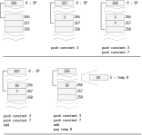
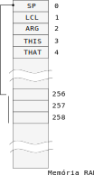

# VM

!!! video
    

A linguagem VM proposta para o curso é baseada em pilha (assim como tantas outras), as operações nesse nível não lidam mais com registradores do computador porém com dados que são colocados e tirados de uma pilha (`stack`). Uma grande vantagem disso é a abstração do hardware, agora não precisamos mais nos preocuparmos com a manipulação dos dados em baixo nível e saber por exemplo quantos registradores possuímos (o VMTranslator será encarregado disso). Um código escrito em VM passa pelas seguintes etapas antes de ser executado em máquina :

```
      VMTranslator          Assembler
 .vm -------------> .nasm -------------> .hack
```

Com o código `vm` conseguimos implementar funções, o que facilita muito o desenvolvimento de qualquer software e prepara o terreno para conseguirmos implementar uma linguagem de alto nível.

O código `vm` é traduzido para linguagem `nasm` pelo VMTranslator (vocês vão ter que fazer parte desse programa no último projeto), e então é montado pelo Assembler para linguagem de máquina.

Temos diversas vantagens quando programamos em linguagem virtual: 

1. Abstração de Hardware 
     - (já não mais lidamos com o hardware diretamente)
1. Portabilidade
1. Código mais alto nível 
     - (chamada de funções, linguagem mais próxima do que estamos acostumados, ...)

!!! example "Exemplo"
    O programa a seguir escrito em vm, faz uso de uma função
    de multiplicação para multiplicar 7*2:

    ``` jvm
    function Main.main 0
	push constant 7
	push constant 2
	call mult 2
    ```
    
    A função de multiplicação `mult` é implementada como a seguir:
    ```
     function mult 2
     push constant 0
     pop local 0
     push argument 1
     pop local 1  
    label loop
     push constant 0
     push local 1
     eq
     if-goto end
     push local 0
     push argument 0
     add
     pop local 0
     push local 1
     push constant 1
     sub
     pop local 1
     goto loop
    label end
      push local 0
      return
    ```
    
!!! tip 
    Temos muitos outros exemplos na pasta:
    
    - `H-VM/src/examples/`

## Pilha

!!! video
    

A linguagem VM é baseada em pilha, ou seja, todas as operações que serão realizadas serão feitas na pilha. A pilha é uma região da memória RAM (no nosso caso começa no endereço 256 da memória RAM) reservada para armazenar os dados que estão sendo manipulados.

A pilha cresce conforme operações de push (envio de dados para a pilha) vão sendo executados, e decresce conforme operações cálculo ou de pull (retirar dados da pilha) são executadas. 

A figura a seguir demonstra o código a evolução da pilha quando o código a seguir é executado:

```
push constant 3
push constant 7
add
pop temp 0
```

Esse código carrega as constantes 3 e 7 para a pilha e faz soma deles, o resultado é guardado no endereço de temp 0.

!!! info "Notaçào 



!!! note "Explicando"
    1. A pilha começa vazia e o Stack Pointer (SP) aponta para `256`
    1. Uma operação de `push constant 3` é executada, SP é incrementando e o valor 3 é colocado no topo da pilha
    1. Uma operação de `push constant 7` é executada, SP é incrementando e o valor 7 é colocado no topo da pilha
    1. Adicionasse os dois valores no topo da pilha `add`
    1. Retira o valor do topo da pilha para o endereço de memória temporário `0`.

### Stack Pointer (SP)

O Stack Pointer é o endereço de memória (==RAM[0]==) reservado por apontar o topo da pilha, ou seja, a próxima posição vazia da pilha. O `SP` é salvo na RAM 0 (R0) e deve ser incrementado/decrementado conforme a pilha vai sendo manipulada.

{width=200}

## Operações

Considerando a seguinte disposição na pilha :

```
     ...
     ...
      X
      Y
SP ->
```

São suportadas as seguintes operações aritméticas na pilha:

#### `add`
- executa: `X + Y`

#### `sub` 
- executa: `X - Y`

#### `neg`
- executa: `-Y`  (complemento de dois)

#### `eq` 
- compara `X == Y`
    - True : resulta em b"11111111111111111", 0xFFFF
    - False: resulta em b"0000000000000000"", 0x0000
    
#### `gt`
- compara `X > Y`
    - True : resulta em b"11111111111111111", 0xFFFF
    - False: resulta em b"0000000000000000"", 0x0000
    
#### `lt` 
- compara `X < Y` 
    - True : resulta em b"11111111111111111", 0xFFFF
    - False: resulta em b"0000000000000000"", 0x0000
    
#### `and` 
- executa: `X and Y` (bit a bit)

#### `or`
- executa: `X or Y` (bit a bit)

#### `not`
- executa: `not Y` (bit a bit)
 
!!! note
    As operações de comparação (`eq`, `gt`, `lt`) resulta em um ==True== ou ==False== e esse resultado é salvo na pilha. Considere o exemplo a seguir (em hexa) que possui inicialmente na pilha os valores `0x2`, `0x3` e `0x5`, após a operação de `eq` os valores 3 e 5 são comparados e resulta em um valor True ou False (`0xFFFF` ou `0x0000`).

```
         -> eq ->    -> gt ->
     0x2          0x2         0xFFFF
     0x3          0x0    SP->
     0x5     SP->
SP->
```

!!! warning
    A pilha não é 'limpada' a cada operação, os endereços que não sofreram modificação dado uma operação continuam lá, mas você não pode considerar que eles são válidos! Se olharmos a memória real do exemplo anterior seria a seguinte:

    ```
               -> eq ->      -> gt ->
         0x2            0x2          0xFFFF
         0x3            0x0     SP-> 0x0
         0x5       SP-> 0x5          0x5
    SP-> 0x0            0x0          0x0
    ```

    O mesmo acontece com arquivos que são deletados do seu computador, o sistema operacional não "limpa a memória" sempre que um arquivo é excluído, apenas apaga o ponteiro para aquele arquivo.

!!! info "stackoverflow"
    Agora você consegue entender o significado do nome do site stack overflow? é um estouro na pilha (quando o tamanho da pilha ultrapassa a memória que está reservado para ela!)
